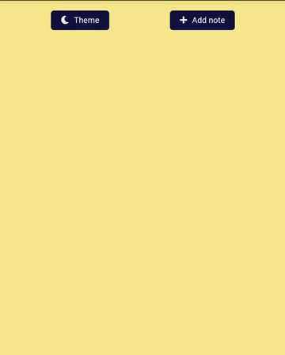

# Notes App 

> A effective accessible notes app.

---

### Table of Contents
- [Description](#description)
- [Technologies](#technologies)
- [How To Use](#how-to-use)
- [License](#license)

---

## Description
- A notes app to note down things, made entirely with HTML, CSS, JavaScript
- Theme switcher to switch between light and dark modes.
- LocalStorage saves all your previous notes.
- Add as many notes as you want.
- You can write your notes in markdown text.
- Theme selected is remembered between sessions.
- Ability to delete unwanted notes.
- Ability to edit the notes.

---

## Technologies
- JavaScript
- HTML
- CSS

---

## How To Use
[click here](https://vshalt.github.io/notes-app) or https://vshalt.github.io/notes-app

---

## License
MIT License
[Read here](./LICENSE)

[Back To The Top](#read-me-template)
